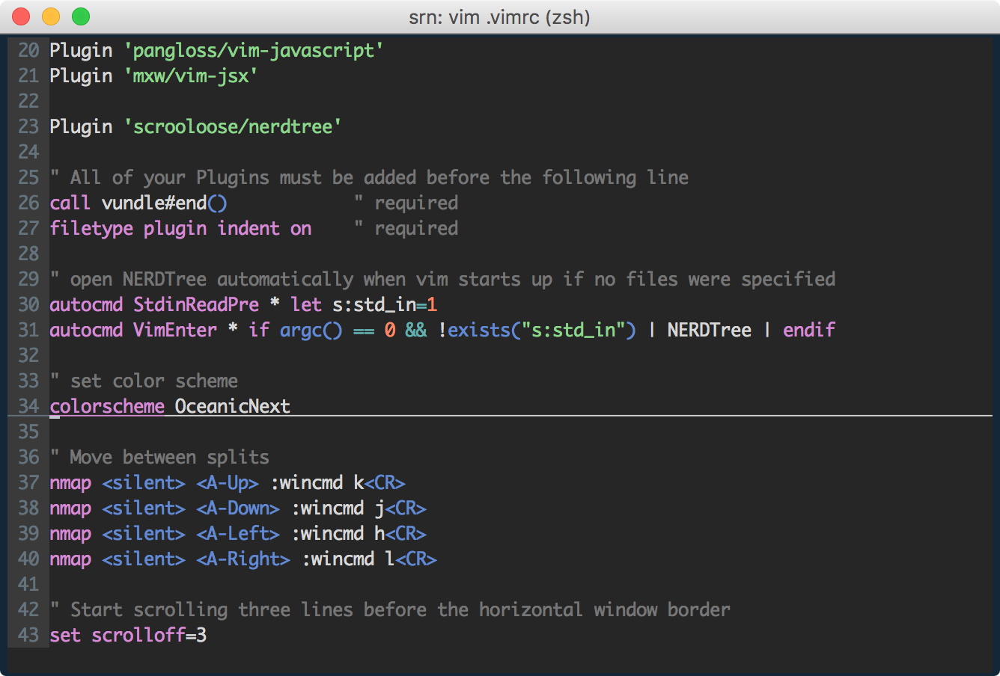

# This project is depercated, please use https://github.com/mhartington/oceanic-next


# oceanic-next-vim


> Port to Vim from [oceanic-next-theme](https://github.com/voronianski/oceanic-next-theme)



Using [coloration](https://github.com/sickill/coloration) and [Vim-toCterm](shawnbiddle.com/Vim-toCterm/)

### Installation

#### Vundle

Place this in your .vimrc:

```
Plugin 'yosiat/oceanic-next-vim'

colorscheme OceanicNext
```

Then run the following in Vim:

```
:source %
:PluginInstall
```

#### pathogen
```
cd ~/.vim/bundle
git clone git@github.com:yosiat/oceanic-next-vim.git
```
